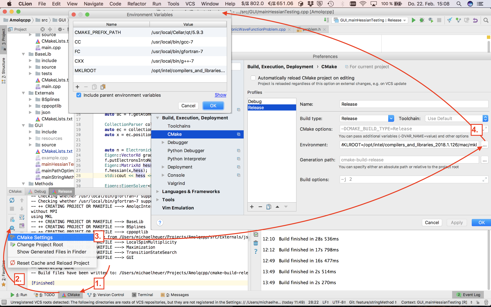
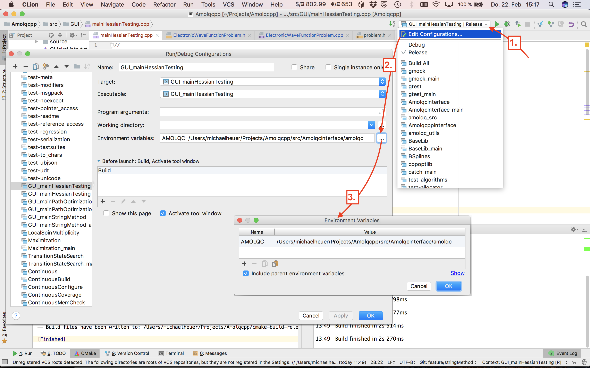

# Amolqc++
Amolqc++ or Amolqcpp is a toolset for wave function analysis and visualization written in C++. It contains and interfaces the QMC program Amolqc (written in Fortran) as an independent submodule.

## Purpose
It is intended to facilitate analyses of the large and high-dimensional datasets generated by Amolqc by providing:
* chemical data structures
* reusable and interchangeable algorithms
* visualization environments
* test environments
* access to external libraries

## Submodules
Amolqcpp contains the following repositories as submodules:
* git@git.rwth-aachen.de:luechow-group/Amolqc.git
* git@git.rwth-aachen.de:luechow-group/CppNumericalSolvers.git
* git@git.rwth-aachen.de:michael.heuer/BSplines.git (owned by Michael Heuer)

## Required Libraries
The build requires the following libraries pre-installed on your local machine:
* CMake 3.5 or higher
* Eigen3
* Qt5.9 or higher

They can be installed via brew on MacOS or apt-get on Debian Linux.
(See our Wiki for more information)

## Installation

### Installing required packages
To install Amolqcpp, Git, CMake, the GNU Compiler Collection (gcc) and the Eigen3 library must be installed. This is most easily achieved by employing a packet manager.

#### MacOS
For MacOS, packet managers like homebrew (https://brew.sh) or macports (https://www.macports.org) make installation process easy. Make sure that you have already installed the Xcode Command Line Tools. You can find out, if the Command Line Tools are already installed, by executing a command like
`gcc` or `make` in the terminal.
We suggest using homebrew which can be installed by executing the following command in the terminal:

```bash
/usr/bin/ruby -e "$(curl -fsSL https://raw.githubusercontent.com/Homebrew/install/master/install)"
```

The required packages can be installed  by executing the following command in the terminal:
```bash
brew install git cmake gcc eigen
```

#### Ubuntu
Using Ubuntus standard packet manager Aptitude we can install the required packages  by executing:

```bash
sudo apt-get install build-essential git cmake gcc-multilib libgomp1 gfortran libeigen3-dev libblas-dev liblapack-dev freeglut3-dev
```

### Installing Qt
To use Amolqcpp's visualization features, Qt (current version 5.9) must be installed
Qt is available under GPL & LGPLv3 licenses and can be downloaded from the following website: https://www.qt.io/download-qt-for-application-development. Qt can also be installed using a packet manager:

#### MacOS
```bash
brew install qt5
```

#### Ubuntu
Download and run the installer

```bash
wget http://download.qt.io/official_releases/qt/5.9/5.9.0/qt-opensource-linux-x64-5.9.0.run
chmod +x qt-opensource-linux-x64-5.9.0.run
./qt-opensource-linux-x64-5.9.0.run
```

or use sudo apt-get
```bash
sudo apt-get install qt5
```

#### Cloning Amolcpp
Make sure you are registered for the GitLab service of https://git.rwth-aachen.de and that you have an SSH-Key for your account on the local machine you are using.
Furthermore, make sure you have permission to all repositiories by asking the git-administrator of the luechow-group.

```bash
git clone git@git.rwth-aachen.de:luechow-group/Amolqcpp.git
```
and check out the branch of interest e.g.`git checkout develop`. Next, execute
```bash
git submodule update --init --recursive
```
to initialize all the submodules.

The next time you checkout a branch e.g.
```bash
git checkout feature/GUI
```
the submodules do not need to be initialized again afterwards. Thus
```bash
git submodule update --recursive
```
should be sufficient.

### Setting environment variables

#### Amolqc
The path to `amolqc` *must* be exported as an environment variable e.g.

```bash
AMOLQC=/Users/michaelheuer/Projects/Amolqcpp/src/AmolqcInterface/amolqc
```
to allow for interfacinng `amolqc` in the `AmolqcInterface` module.

#### Compilers
Compilers and the MKL root *can* be specified e.g.
```bash
CC=/usr/local/bin/gcc-7
FC=/usr/local/bin/gfortran-7
CXX=/usr/local/bin/g++-7
MKLROOT=/opt/intel/compilers_and_libraries_2018.1.126/mac/mkl
```
.
Otherwise the default compilers are used.


#### Qt5
If `Qt5` was installed via homebrew on MacOS
the path to the Qt5 libraries *must* be added to the environment variable `CMAKE_PREFIX_PATH` e.g.:
```bash
CMAKE_PREFIX_PATH=/usr/local/Cellar/qt/5.9.3
```

If `Qt5` was installed from the installer, the installation directory must be specified in the environment variable `Qt5_DIR` e.g.:

```bash
Qt5_DIR=/home/heuer/Qt/5.10/gcc_64
```

## Running Amolqcpp from the Command-Line

Create a build directory e.g.
```bash
mkdir cmake-build-release
cd cmake-build-release
```
and conduct an out-of-source-build:

```bash
cmake .
```
. Then make an executable by specifying its name:
```bash
make executableName
```
Afterwards, `cd` to the directory of the executable and run it with

```bash
./executableName
```


## Developing and Running Amolqcpp with CLion IDE
It is suggested to use CLion (https://www.jetbrains.com/clion/) as an IDE for C++ which is free for educational and non-commercial purposes.

CLion
* is platform independent (Linux, MacOS, Windows),
* comes bundled with CMake, git, debuggers (LLDB, GDB), and profilers (Valgrind)
* has a Fortran Language Support and many other plugins
* and supports google-tests.

### Setting Environment and Runtime Environment Variables in CLion
In CLion, environment variables can be exported during build and execution which is shown in the images below.

#### Export of environment variables for the build in CLion:
<p></p>


#### Export of environment variables for runtime in CLion:
<p></p>